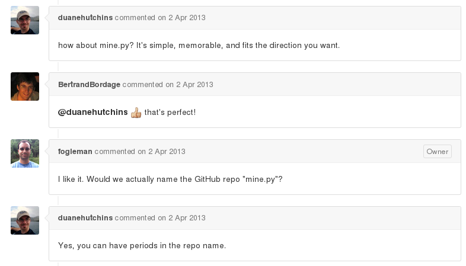

It all started with [fogleman](https://github.com/fogleman/Minecraft). He built a beautiful clone of Minecraft using pyglet. It grew really nicely, but it didn't run on Python 3.

[ProgVal](https://github.com/ProgVal/Minecraft/tree/python3) solved that on a branch called "python3". That's what I forked, but I have no plans on working with python2, so I merged that into my master branch.

Trying to avoid [trademark issues](https://github.com/fogleman/Minecraft/issues/23), I decided to change the name of the repo to "mine.py", as suggested on the original issue itself.

Thinking about where to go next, I thought about building a detached world server API. But then I remembered [dockercraft](https://github.com/docker/dockercraft), which is a Minecraft-based Docker instances visualizer.

Dockercraft uses a FOSS (free and open source software) Minecraft-compatible server called [cuberite](http://cuberite.org/), so there's no need to reinvent the wheel here! How about plugin **mine.py** to cuberite? Let's see how it goes...

Turns out there's a lot of existing clients [documented here](http://wiki.vg/Client_List). It seems reasonable to use one of them to connect cuberite and mine.py.
